<div align="center">
   

## Connect Me

<strong> Connect_Me is a user-friendly mobile application that empowers users to streamline their communication, networking, and information-sharing processes with the power of QR codes. Whether you're a professional seeking to exchange business details, a social media enthusiast connecting with new friends, or a tech-savvy individual looking for a convenient way to share information, Connect_Me is the ultimate solution for all your QR code needs. </strong>

<br/>
<a href=''></a>
<a href=''></a>

<sub>Built by <a href="https://twitter.com/_Captured_Heart">Nkpozi Marcel Kelechi</a></sub>
<br />

## AN INTRO VIDEO OF THE APP

https://github.com/Captured-Heart/connect_me/assets/69226443/63c2abe0-4c5f-4151-9f9a-77beb289a4b7

<!-- <i><h3 style="color: green">You can download the apk directly from my firebase distribution console <a href="https://appdistribution.firebase.dev/i/e5a7b73fefe2dd61">LearnGual Assessment</a></h3></i> -->

</div>

---

## Getting Started

After cloning,

### FVM setup

it runs on flutter version: flutter: ">=3.10.0", dart: ">=3.0.0 <4.0.0".

Install `fvm` if not already installed.

```bash
dart pub global activate fvm
```

Install local `flutter` version.

```bash
fvm install
```
---

### Firebase setup
This project contains firebase analytics, cloud firestore, firebase storage, and firebase Auth files.

1. If you haven't already, install the Firebase CLI.
2. Log into Firebase using your Google account by running the following command:
```bash
firebase login
```
3. Install the FlutterFire CLI by running the following command from any directory:
```bash
dart pub global activate flutterfire_cli
```

4. From my project directory, run the following command to install the core plugin:
```bash
flutter pub add firebase_core
```
5. From your Flutter project directory, run the following command to ensure that your Flutter app's Firebase configuration is up-to-date:
```bash
flutterfire configure
```
To see the complete set-up process visit: [Firebase Google](https://firebase.google.com/docs/flutter/setup?platform=ios)

# Key Features

1. QR Code Generator:

   - Easily create custom QR codes for various purposes such as sharing contact details, website URLs, social media profiles, work experience, and more.

2. QR Code Scanner:

   - Seamlessly scan QR codes using your device's camera and also via QR code images

3. Personal Information Profile:

   - Create, update, and save your personal information profile within the app, including contact details, social media links, bio, and profile picture.
   - Attach your personal information profile to a custom QR code, allowing you to share comprehensive details with others in a single scan.

4. Add Users via QR Codes:

   - Easily add new contacts to your network or exchange information with colleagues, friends, or business partners by scanning their QR codes.

5. User-Friendly Interface:

- Enjoy a sleek and intuitive user interface designed for seamless navigation and effortless interaction.
- Light and dark modes

## UI Shots

<div style="text-align: center">
  <table>
    <tr>
      <td style="text-align: center">
        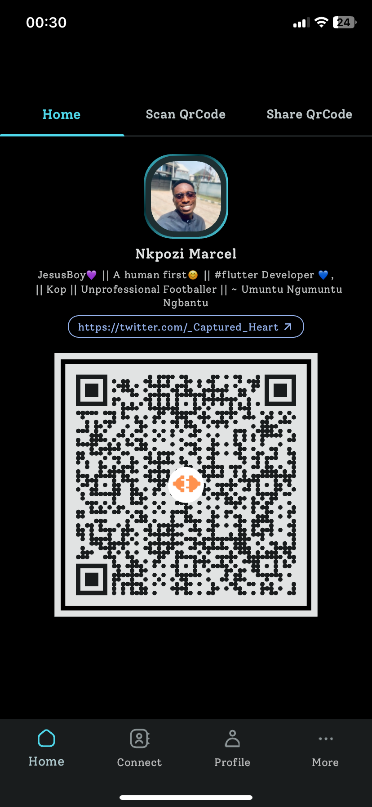
      </td>
      <td style="text-align: center">
        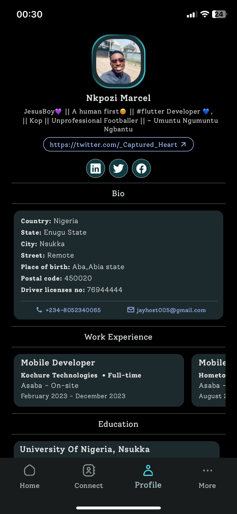
      </td>
      <td style="text-align: center">
        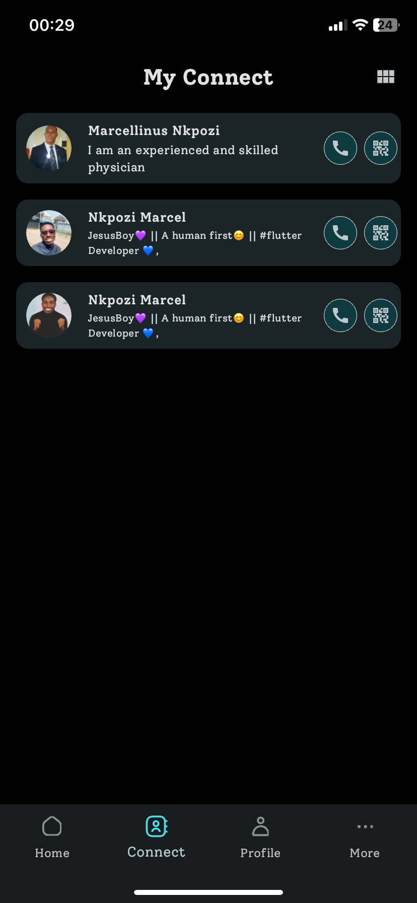
      </td>
       <td style="text-align: center">
        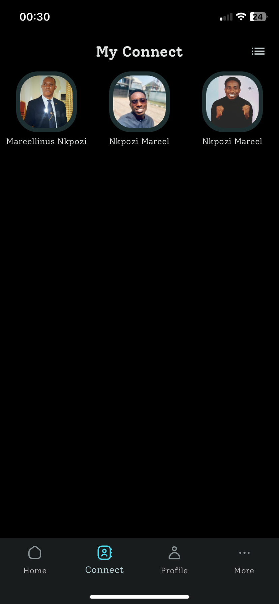
      </td>
      <td style="text-align: center">
        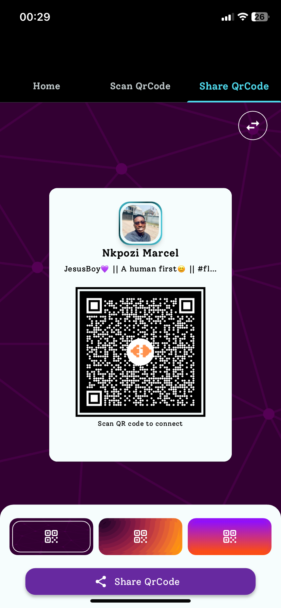
      </td>
      <td style="text-align: center">
        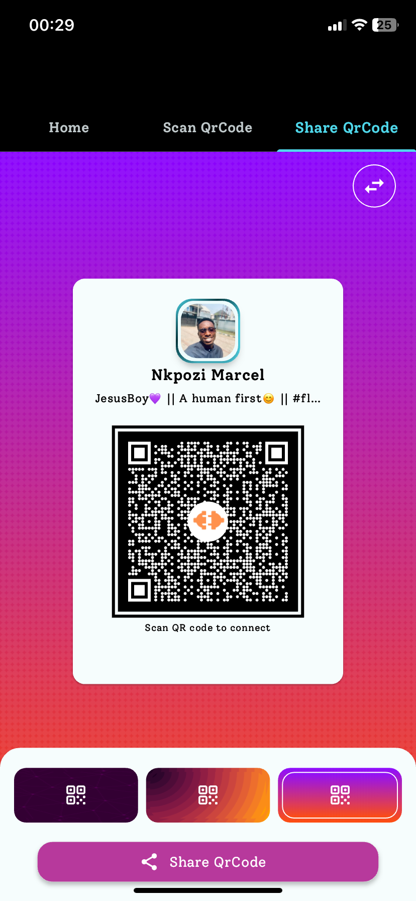
      </td>
       <td style="text-align: center">
        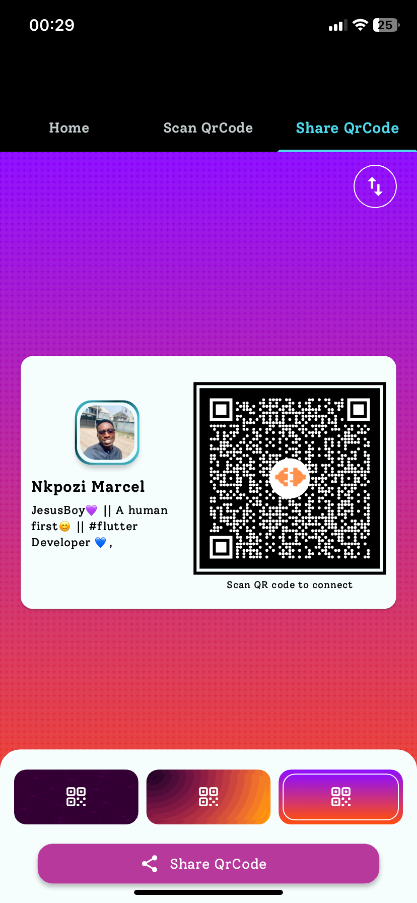
      </td>
       <td style="text-align: center">
        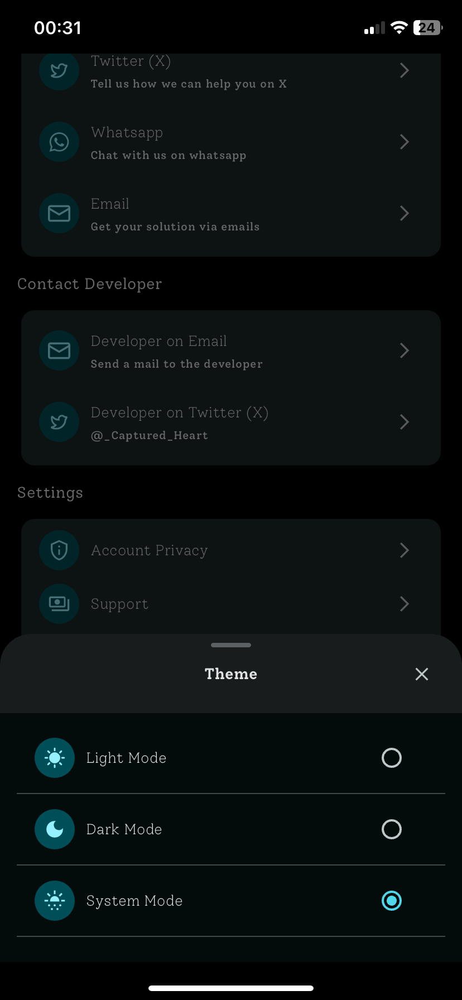
      </td>
    </tr>
    <tr>
       <td style="text-align: center">
        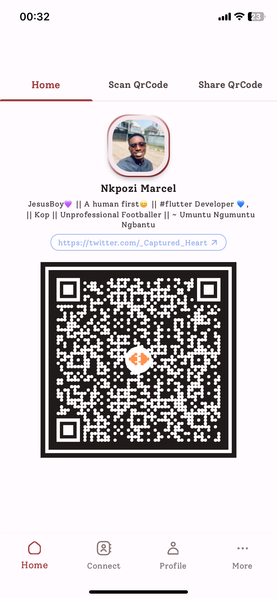
      </td>
      <td style="text-align: center">
        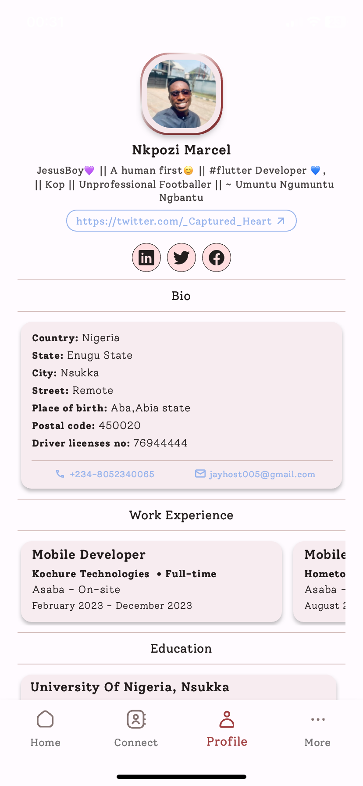
      </td>
      <td style="text-align: center">
        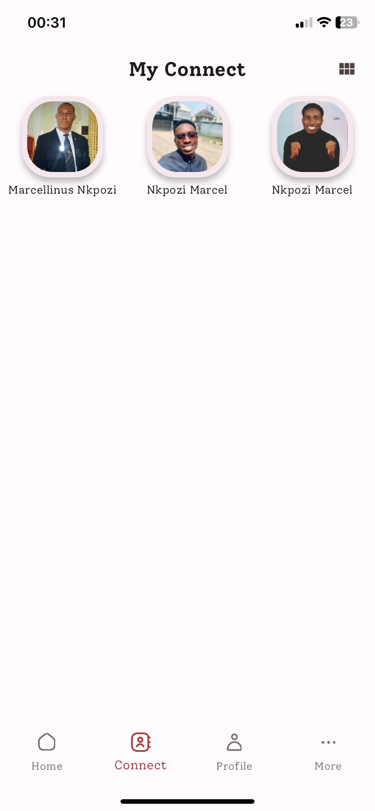
      </td>
       <td style="text-align: center">
        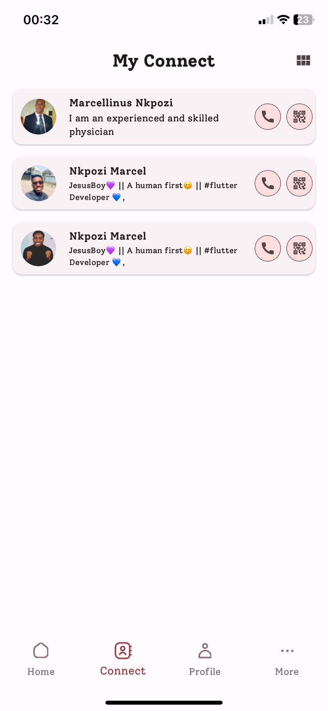
      </td>
      <td style="text-align: center">
        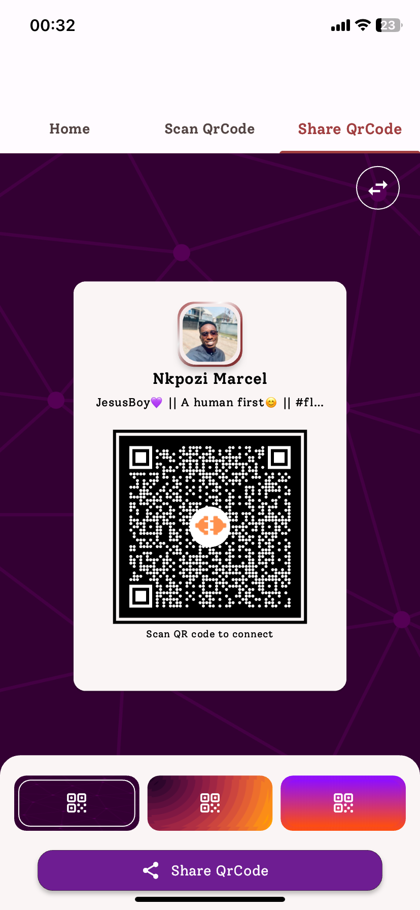
      </td>
      <td style="text-align: center">
        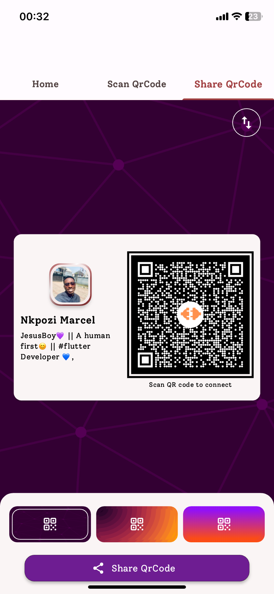
      </td>
       <td style="text-align: center">
        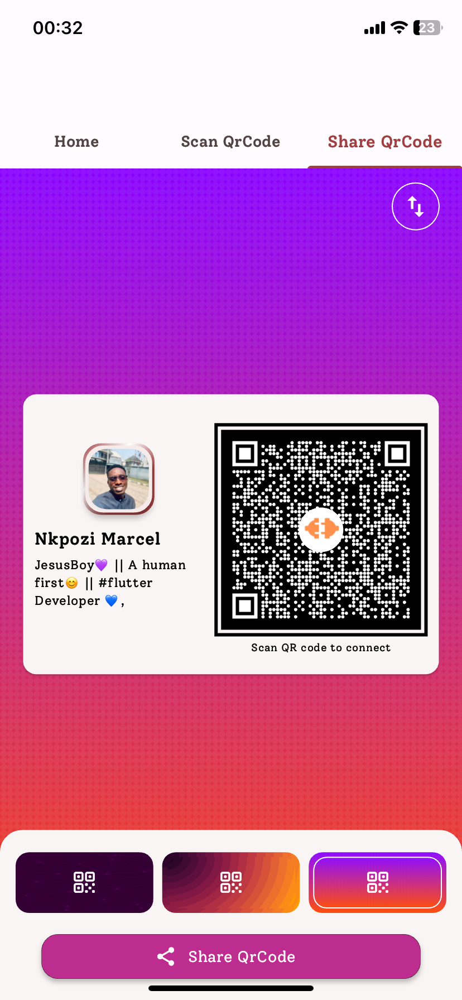
      </td>
       <td style="text-align: center">
        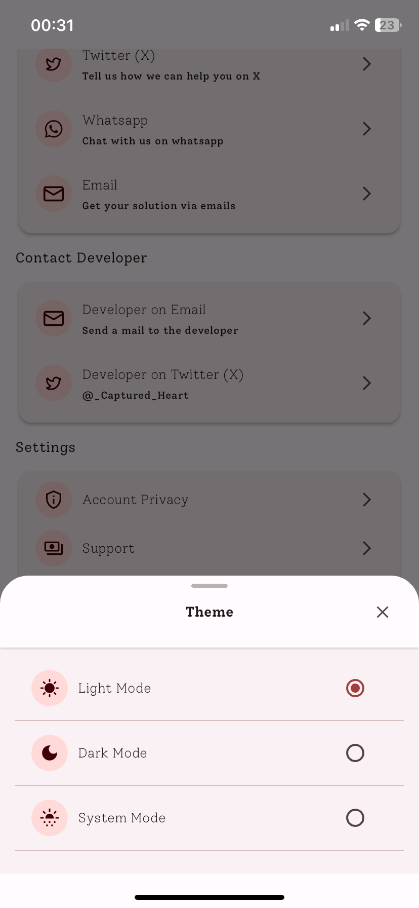
      </td>
    </tr> 
  </table>
</div>

## Tools

- [Google-Sign-in](https://pub.dev/packages/google_sign_in)
- [QR_Flutter](https://pub.dev/packages/qr_flutter): QR.Flutter is a Flutter library for simple and fast QR code rendering via a Widget or custom painter.
- [Mobile Scanner](https://pub.dev/packages/mobile_scanner):A universal scanner for Flutter based on MLKit. Uses CameraX on Android and AVFoundation on iOS.
- [Firebase_Messaging](https://pub.dev/packages/firebase_messaging): Firebase Cloud Messaging (FCM) is a cross-platform messaging solution that lets you reliably send messages at no cost.
- [Firebase_Analytics](https://pub.dev/packages/firebase_analytics):Google Analytics is an app measurement solution, available at no charge, that provides insight on app usage and user engagement.
- [Local Notifications](https://pub.dev/packages/flutter_local_notifications): A cross platform plugin for displaying local notifications.
- [Mocktail](https://pub.dev/packages/mocktail): Mocktail focuses on providing a familiar, simple API for creating mocks in Dart (with null-safety) without the need for manual mocks or code generation.
- [persistent_bottom_nav_bar](https://pub.dev/packages/persistent_bottom_nav_bar): A persistent/static bottom navigation bar for Flutter.
- [shared_preferences](https://pub.dev/packages/shared_preferences): Use this tool for persistent storage for simple data
- [Wolt_Modal_Sheet](https://pub.dev/packages/wolt_modal_sheet): this UI component offers a visually appealing and user-friendly modal sheet with multiple pages, motion animation for page transitions, and scrollable content within each page.
- [flutter_riverpod](https://pub.dev/packages/flutter_riverpod): A very great tool for managing states across the application by Remi Rousselette
- [Dartz](https://pub.dev/packages/dartz): Use for functional programming in Dart

For a full description of OSS used, see pubspec.yaml
